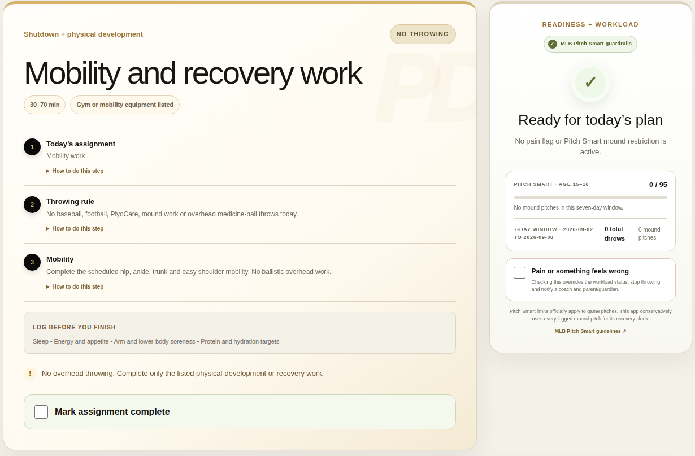
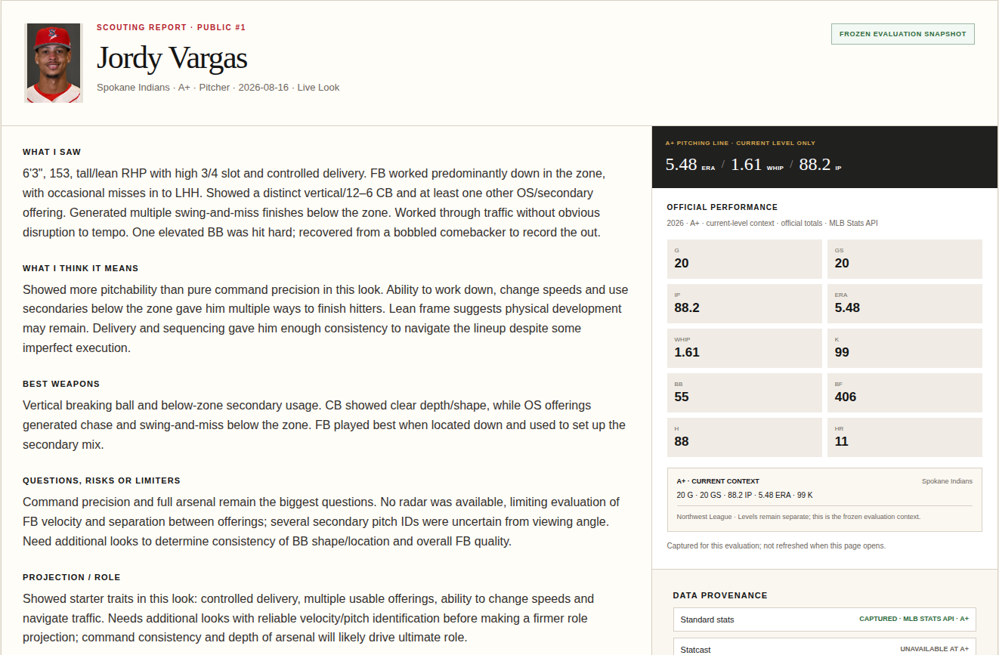

# Michael J. Nichols

**Operations leadership · Product delivery · Baseball intelligence**

I build systems that turn complex plans and scattered data into useful decisions. My foundation is **multi-unit leadership at Best Buy and an MBA**. As the founder of **Rogue Baseball Intelligence**, I apply that experience to athlete development, scouting support, and practical workflow automation.

**[PDOS demo](https://demo.roguebaseballiq.com/) · [Scouting Notebook demo](https://roguebaseballiq.com/scouting-demo/) · [Python project](projects/mlb-pythagorean-expectation/) · [LinkedIn](https://www.linkedin.com/in/mjnichols1/)**

## Working products

<table>
<tr>
<td width="50%" valign="top">
<h3>Player Development OS</h3>

<strong>Make a season-long plan usable today.</strong> Connect team schedules, actual workload, daily assignments, and coach review.

<a href="https://demo.roguebaseballiq.com/">Open demo</a> · <a href="https://github.com/MichaelJNichols/player-development-os-portfolio/blob/main/docs/CASE-STUDY.md">Read case study</a>

</td>
<td width="50%" valign="top">
<h3>Scouting Notebook</h3>

<strong>Connect the field look to the evidence.</strong> Separate observation, interpretation, projection, and confidence; check role- and level-appropriate data.

<a href="https://roguebaseballiq.com/scouting-demo/">Open demo</a> · <a href="work/scouting-notebook.md">Explore the product decisions</a>

</td>
</tr>
</table>

*Actual public-demo captures, September 8, 2026. [View larger screenshots and context.](work/product-previews.md)*

## Analysis you can inspect

**[Baseball Analytics Lab — MLB Pythagorean Expectation](projects/mlb-pythagorean-expectation/)**  
A complete Python example comparing all 30 teams' 2025 records with run-based expected wins. Includes the original analysis script, retained data, chart, and an offline reproduction path.

[Read the Python](projects/mlb-pythagorean-expectation/analyze.py) · [Inspect the data](projects/mlb-pythagorean-expectation/data/mlb_pythagorean_2025.csv) · [See the chart](projects/mlb-pythagorean-expectation/charts/mlb_pythagorean_2025.png)

## Beyond baseball

**[Cozi for ChatGPT](work/cozi-calendar-integration.md)** connects a private family calendar to seven read-only tools for schedules, conflicts, shared free time, and availability. A deployed example of turning an everyday coordination problem into a focused integration.

## What I bring

I lead problem definition, workflow design, prioritization, and acceptance, using AI-assisted development to implement and iterate. These projects connect the operating discipline of my leadership career with hands-on product and data work.

**Baseball:** development systems, scouting support, operations, and video/data workflows.  
**Business and technology:** product operations, program delivery, operational transformation, and practical AI adoption.

[Product-management portfolio](https://github.com/MichaelJNichols/player-development-os-portfolio) · [Rogue Baseball Intelligence](https://roguebaseballiq.com/) · [Connect on LinkedIn](https://www.linkedin.com/in/mjnichols1/)

---

*Updated September 8, 2026. Independent projects. Public materials use synthetic or public baseball data; private application source and personal records remain private. PDOS multi-athlete work is in staging, not a commercial launch.*
