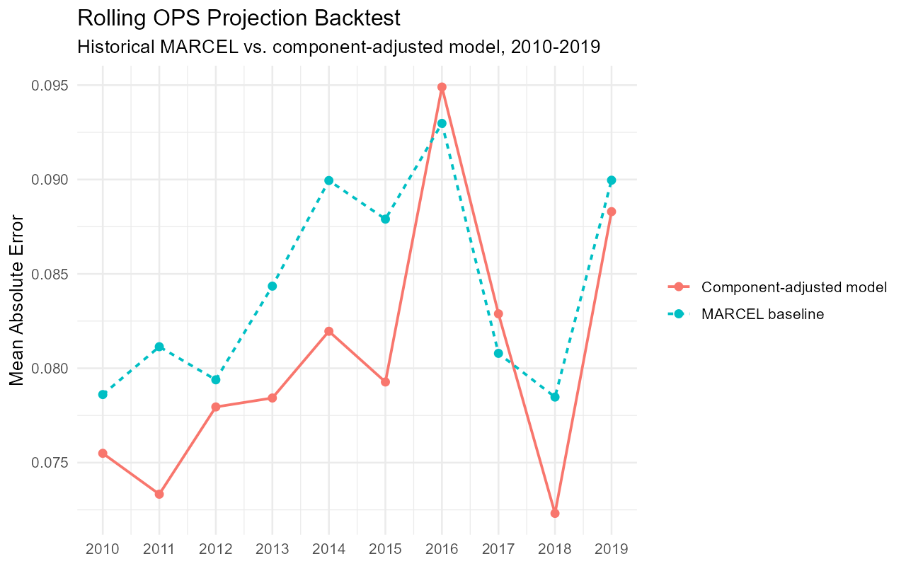

# Improving MARCEL: 2021 OPS Projections in R

**R · tidyverse · Lahman · SABR Analytics Certification Level 3**

[Back to profile](https://github.com/MichaelJNichols) · [Inspect the backtest results](outputs/backtest_results.csv)

Can a hitter's walk rate, strikeout rate, and power help improve a simple OPS projection?

For my final project in SABR Analytics Certification Level 3, I reproduced the assignment's MARCEL baseline and built a linear model to correct its historical errors. The private lab turns the exploratory notebook work into one runnable R script. This public page mirrors its writeup, chart, and annual backtest results.

## Results

| Evaluation | MARCEL MAE | Adjusted model MAE | Reduction |
| --- | ---: | ---: | ---: |
| Rolling backtest, 2010–2019 | 0.08435 | 0.08048 | 4.6% |
| Submitted 2021 evaluation | ~0.07818 | 0.06993 | ~10.6% |

MAE is mean absolute error in OPS; lower is better. The adjusted model beat MARCEL in **8 of 10 backtest seasons**. Backtest averages give each season equal weight.

The 2021 figures are the previously reported assignment evaluator results, not a result recalculated by this script. Its baseline MAE is inferred from the reported model MAE of 0.06993 plus the evaluator's MAE gap of 0.008248. The separately reported median absolute error of 0.086 is a different metric.

## Method

The assignment baseline weights the previous three seasons' OPS 5/4/3, regresses toward .720 based on plate appearances, and applies an age adjustment.

Using Lahman batting data, I combine multi-team stints into player-seasons and build examples with three consecutive prior seasons of at least 100 plate appearances each. A linear regression predicts the baseline's error using age, recent OPS, OPS trend and volatility, reliability, walk rate, strikeout rate, and isolated power:

**Adjusted OPS = MARCEL OPS + predicted correction**

Each backtest trains only on years before its test season. The final model trains through 2019 and uses the assignment data plus 2020 batting components to project 2021. The submitted model specification was locked before the 2021 evaluation.

## Limits and takeaway

- These results compare against the assignment's simplified MARCEL baseline, not every implementation of MARCEL or a commercial projection system.
- The historical sample favors established hitters with three consecutive qualifying seasons. It does not establish performance for rookies or players returning after a missed season.
- The final projection uses the shortened 2020 season. Its smaller samples make recent batting rates less stable.
- The rolling backtest informed development; it is not an untouched evaluation of model selection. The separately reported 2021 result covers one assignment sample.
- This model does not explicitly adjust for parks, injuries, or changing league conditions.

My main takeaway: component batting information can improve a simple baseline while keeping the model understandable. The backtest also shows why improvement should be checked across seasons rather than assumed from one good result.

## Data and verification

The analysis reads the [public assignment CSV](https://huggingface.co/spaces/rkarthur/sabr3evaluation/raw/main/data/SABR3_data_for_assignment.csv). Historical data come from the `Lahman` package.

Verified with R 4.6.1, tidyverse 2.0.0, and Lahman 14.0-0: 175 complete player projections and the backtest values above. The code cleanup preserved both projection and backtest CSV values exactly. Package versions are not pinned; future data revisions may change results. The script does not retrieve 2021 outcomes or reproduce the external evaluator.

## Project materials

- [Backtest chart](outputs/backtest_mae.png): the same visual used in the private project.
- [Annual backtest results](outputs/backtest_results.csv): the same results used to create the chart.
- The R script, RStudio project, and generated submission remain in the private lab; local run instructions are available there.

Code cleanup and portfolio editing used AI assistance; the analytical specification and results were preserved.
