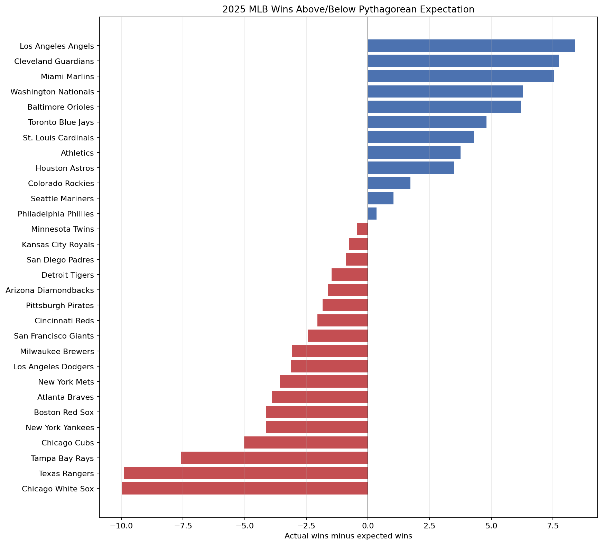

# Baseball Analytics Lab

### From a baseball question to inspectable code and results.

The **[MLB Pythagorean Expectation project is now published here](../projects/mlb-pythagorean-expectation/)** as a self-contained public example—not just a description of private work.

It compares all 30 MLB teams' 2025 regular-season records with expected wins calculated from runs scored and allowed. The original Python script and saved dataset are unchanged; an offline reproduction helper and regression tests were added for this public release.

[Read the code](../projects/mlb-pythagorean-expectation/analyze.py) · [View all 30 teams](../projects/mlb-pythagorean-expectation/data/mlb_pythagorean_2025.csv) · [Reproduce the analysis](../projects/mlb-pythagorean-expectation/README.md#run-it)

**What it demonstrates:** public API retrieval, pandas calculations, CSV output, matplotlib visualization, and a written interpretation that distinguishes measuring a difference from explaining its cause.

The broader lab repository remains private. This reviewed public example includes the executable analysis, its complete retained data, and the chart; no private repository history or unrelated files were copied.

[Back to profile](../README.md)
