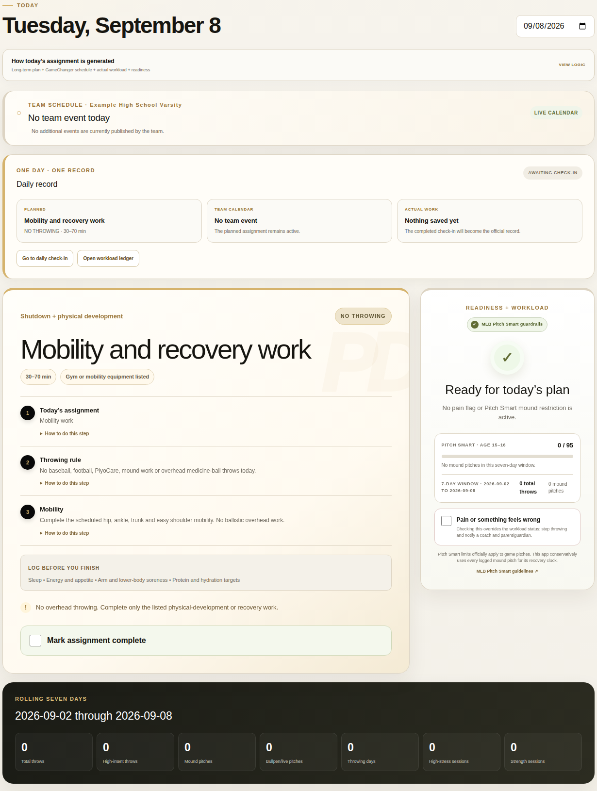
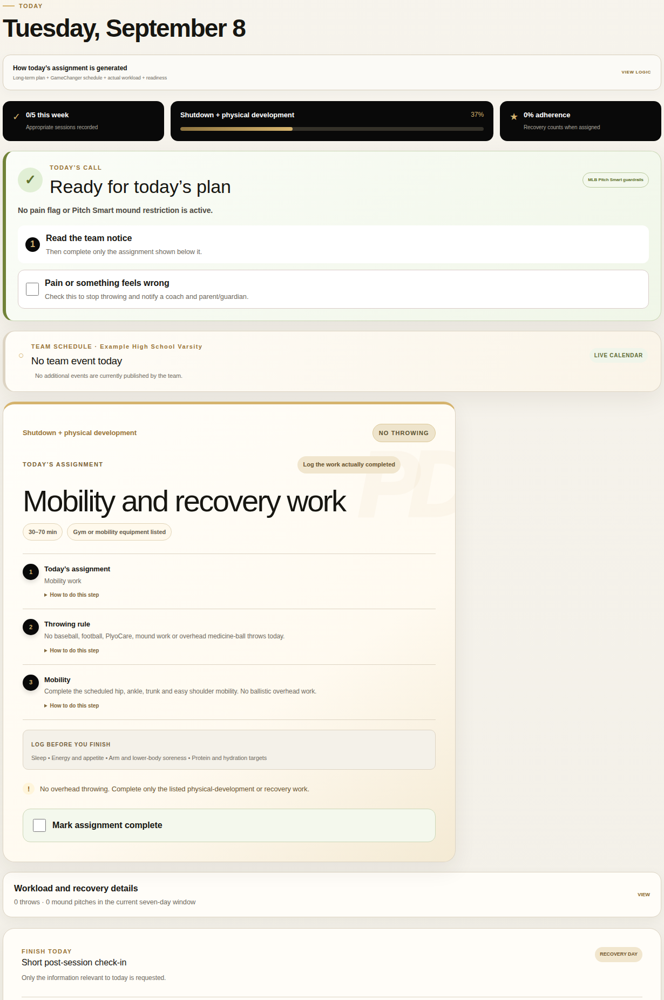

# Product previews

**Actual public-demo screenshots · September 8, 2026**

[Back to profile](../README.md) · [PDOS case study](https://github.com/MichaelJNichols/player-development-os-portfolio/blob/main/docs/CASE-STUDY.md)

## Player Development OS — coach view

The coach sees the assigned work, team context, daily record, and workload/readiness controls together. This capture shows a recovery day in the public synthetic demonstration.

[Open PDOS](https://demo.roguebaseballiq.com/) and choose **Explore coach view**. The featured examples let a visitor inspect different training situations without changing saved demonstration data.

## Player Development OS — athlete view

The athlete view emphasizes the current assignment and completion rather than the coach's management controls. Choose **Explore player view** from the demo welcome page to compare the experience.

## Scouting Notebook — published report

Observation and interpretation sit beside the report's role- and level-specific evidence. The evaluation date and data-capture context remain visible.

[Open the Scouting Notebook reports](https://roguebaseballiq.com/scouting-demo/#report)

## Capture context

These are crops of actual browser screenshots, not mockups or generated product screens. No UI content was rewritten. PDOS identities and records are synthetic. The Notebook image is an already-public professional-player report. Browser visits used the public entry paths; no private product accounts or production youth records were accessed.

The welcome pages and PDOS coach/player entry paths loaded successfully during this check. Mobile layouts were inspected at 390 pixels with no horizontal page overflow detected. This is a dated navigation/presentation check, not a full regression or uptime guarantee.
