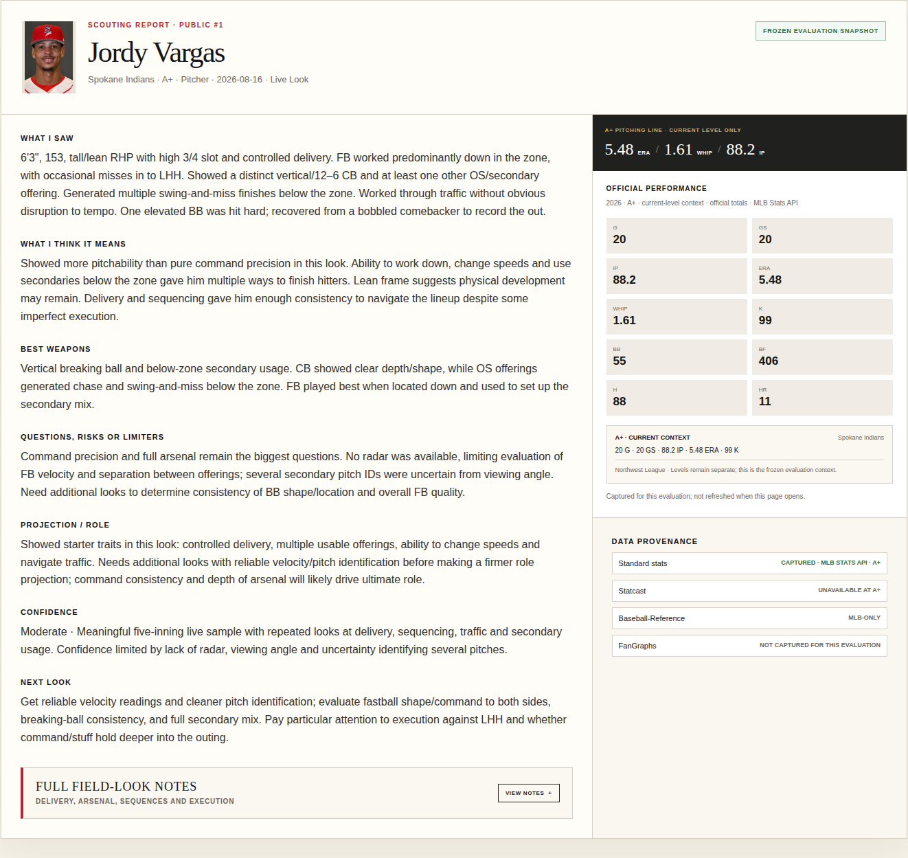

# Scouting Notebook

### Connect the field look to the evidence.

**Baseball evaluation · Data products · Workflow design**

[Open the demo](https://roguebaseballiq.com/scouting-demo/) · [View the published reports](https://roguebaseballiq.com/scouting-demo/#report) · [Back to profile](../README.md)

*Public-demo capture, September 8, 2026. The report retains its original evaluation date and captured statistics.*

## The problem and the product

A player page can provide statistics without helping an evaluator form a better report. I built the Notebook to keep observation, interpretation, projection, confidence, and the next-look question distinct, then check the judgment against appropriate data.

**Scout first. Data second.** Imported statistics support or challenge an evaluation; they do not generate a scouting grade.

The public demo includes five published High-A field reports and an interactive player-data pipeline. The private workspace supports live, video, and hybrid evaluations with separate position-player and pitcher structures.

## Product decisions that matter

| Decision | Value to the evaluator |
|---|---|
| Stable MLBAM player identity | Match data to the right player. |
| Separate hitter and pitcher schemas | Prevent pitching opponent averages from appearing as a hitter slash line. |
| Competition-level and source context | Explain which metrics actually apply to this player and this look. |
| Missing values stay missing | Avoid treating unavailable tracking as zero performance. |
| Frozen evaluation snapshots | Distinguish what was known at the look from what is available now. |

The pipeline combines MLB identity and official statistics with Baseball Savant, Baseball-Reference, and FanGraphs where coverage applies. Operating work includes scheduled refreshes, validation, dataset sharding, bounded retries, and incident escalation while preserving the last validated committed data.

## My contribution

I defined the evaluator workflow, report structure, source rules, priorities, and acceptance expectations, and directed AI-assisted implementation. Live scouting and report preparation shaped the requirements.

For baseball work, this connects field observation to a reviewable decision. For broader product roles, it demonstrates data-contract design, external-dependency management, and turning uncertain information into a usable workflow.

*Current scope: public demo and private founder workspace. The complete retrospective-calibration vision remains in development. This independent project is not an MLB, club, or data-provider endorsement.*
